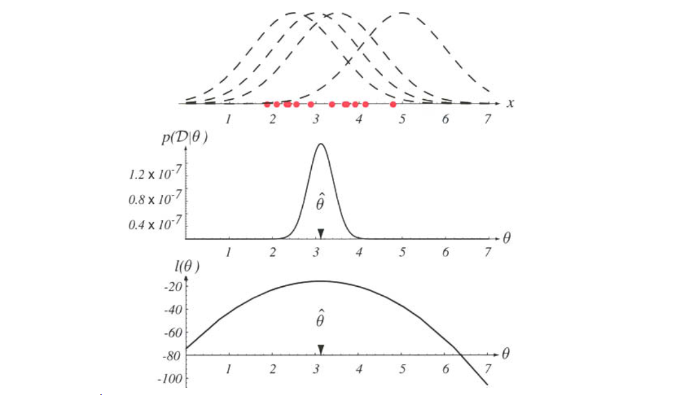

# Chapter 3: Parametric Probability Density Estimation
## Maximum Likelihood Estimation (MLE)

**Course:** Statistical Machine Learning  
**Reference:** Duda, R. O., Hart, P. E., & Stork, D. G. (2000). *Pattern Classification* (2nd ed.). Wiley-Interscience.  
**Prerequisites:** Chapter 2 (Bayesian Decision Theory)  
**Topics:** Parametric Estimation, Gaussian Distributions, Likelihood vs. Probability  

---

## 1. Introduction & Motivation

In Chapter 2, we established the **Bayesian Decision Rule**, which is theoretically optimal for minimizing classification error. The rule requires computing the posterior probability $P(\omega_i|\mathbf{x})$ for each class $\omega_i$:

$$ P(\omega_i | \mathbf{x}) = \frac{p(\mathbf{x} | \omega_i) P(\omega_i)}{p(\mathbf{x})} $$

While the theory is sound, a major practical obstacle remains: **We do not know the class-conditional densities $p(\mathbf{x}|\omega_i)$**. In real-world problems, the underlying distribution that generates the data is unknown.

To proceed, we must **estimate** these densities from a training dataset $\mathcal{D}$. This is the domain of **Statistical Parameter Estimation**.

**Maximum Likelihood Estimation (MLE)** is the most common parametric method used for this purpose. It assumes a specific form for the density (e.g., Gaussian) and finds the parameters $\theta$ that make the observed data most probable.

---

## 2. The Concept of Likelihood

The likelihood function measures how "likely" a specific set of parameters is, given the observed data. It is critical to distinguish this from the probability density function (PDF).

### 2.1 Probability vs. Likelihood
1.  **Probability Density Function $p(x|\theta)$**: Describes the distribution of the data $x$ when parameters $\theta$ are **fixed**.
2.  **Likelihood Function $L(\theta|\mathcal{D})$**: Describes the probability of the dataset $\mathcal{D}$ when data is **fixed** and parameters $\theta$ are variable.

As noted in Duda & Hart, the likelihood function lives in a different mathematical space than the PDF. The functional form of the likelihood is not necessarily the same as the functional form of the density.

**Figure 3.1:** The top graph shows several training points in one dimension, known or assumed to be drawn from a Gaussian of a particular variance, but unknown mean. Four of the infinite number of candidate source distributions are shown in dashed lines. The middle figures shows the likelihood $p(\mathcal{D}|\theta)$ as a function of the mean. If we had a very large number of training points, this likelihood would be very narrow. The value that maximizes the likelihood is marked $\hat{\theta}$; it also maximizes the logarithm of the likelihood — i.e., the log-likelihood $l(\theta)$, shown at the bottom. Note especially that the likelihood lies in a different space from $p(x|\hat{\theta})$, and the two can have different functional forms.

---

## 3. Mathematical Derivation: Univariate Gaussian

We begin with the simplest case: estimating parameters of a univariate Gaussian. This lays the foundation for the multivariate case used in pattern recognition.

### 3.1 Problem Definition
Let $\mathcal{D} = \{x_1, x_2, \dots, x_n\}$ be a dataset of $n$ independent and identically distributed (i.i.d.) samples. We assume the data is drawn from a univariate Gaussian distribution parameterized by mean $\mu$ and variance $\sigma^2$:

$$p(x | \mu, \sigma^2) = \frac{1}{\sqrt{2\pi\sigma^2}} \exp\left(-\frac{(x - \mu)^2}{2\sigma^2}\right)$$

### 3.2 The Likelihood Function
The likelihood function $L(\mu, \sigma^2)$ is the joint probability density of the observed data:

$$
\begin{aligned}
L(\mu, \sigma^2) &= p(\mathcal{D} | \mu, \sigma^2) \\
&= \prod_{k=1}^n p(x_k | \mu, \sigma^2) \\
&= \prod_{k=1}^n \frac{1}{\sqrt{2\pi\sigma^2}} \exp\left(-\frac{(x_k - \mu)^2}{2\sigma^2}\right) \\
&= \left( \frac{1}{\sqrt{2\pi\sigma^2}} \right)^n \exp\left( -\sum_{k=1}^n \frac{(x_k - \mu)^2}{2\sigma^2} \right)
\end{aligned}
$$

### 3.3 The Log-Likelihood Function
Directly maximizing $L$ is computationally difficult due to the product of exponentials. Since the logarithm is a strictly monotonic function, maximizing the **log-likelihood** $\ell(\mu, \sigma^2)$ yields the same parameter estimates as maximizing the likelihood.

$$
\begin{aligned}
\ell(\mu, \sigma^2) &= \log L(\mu, \sigma^2) \\
&= \sum_{k=1}^n \left[ -\frac{1}{2} \log(2\pi) - \frac{1}{2} \log(\sigma^2) - \frac{(x_k - \mu)^2}{2\sigma^2} \right] \\
&= -\frac{n}{2} \log(2\pi) - \frac{n}{2} \log(\sigma^2) - \frac{1}{2\sigma^2} \sum_{k=1}^n (x_k - \mu)^2
\end{aligned}
$$

### 3.4 Estimating the Mean ($\mu$)
To find the Maximum Likelihood Estimate (MLE) $\hat{\mu}$, we take the partial derivative of $\ell$ with respect to $\mu$ and set it to zero:

$$
\frac{\partial \ell}{\partial \mu} = \frac{1}{\sigma^2} \sum_{k=1}^n (x_k - \mu) = 0
$$

Solving for $\mu$:
$$
\sum_{k=1}^n x_k - n\hat{\mu} = 0 \implies \hat{\mu} = \frac{1}{n} \sum_{k=1}^n x_k
$$
**Result:** The MLE for the mean is the **sample mean**.

### 3.5 Estimating the Variance ($\sigma^2$)
To find the MLE $\hat{\sigma}^2$, we take the partial derivative with respect to $\sigma^2$ (let $\tau = \sigma^2$):

$$
\frac{\partial \ell}{\partial \tau} = -\frac{n}{2\tau} + \frac{1}{2\tau^2} \sum_{k=1}^n (x_k - \mu)^2 = 0
$$

Solving for $\tau$:
$$
\hat{\sigma}^2 = \frac{1}{n} \sum_{k=1}^n (x_k - \hat{\mu})^2
$$
**Result:** The MLE for the variance is the **sample variance** (biased, denominator $n$).

---

## 4. Extension to Multivariate Gaussian

In Pattern Classification, features are typically vectors $\mathbf{x} \in \mathbb{R}^d$. The univariate derivation extends naturally to the **Multivariate Gaussian Distribution**.

### 4.1 Density Function
$$p(\mathbf{x} | \boldsymbol{\mu}, \boldsymbol{\Sigma}) = \frac{1}{(2\pi)^{d/2} |\boldsymbol{\Sigma}|^{1/2}} \exp\left( -\frac{1}{2} (\mathbf{x} - \boldsymbol{\mu})^T \boldsymbol{\Sigma}^{-1} (\mathbf{x} - \boldsymbol{\mu}) \right)$$

### 4.2 MLE Estimates
Following the same log-likelihood maximization procedure:

1.  **Mean Vector ($\boldsymbol{\mu}$):**
    $$ \hat{\boldsymbol{\mu}} = \frac{1}{n} \sum_{k=1}^n \mathbf{x}_k $$
    The MLE is the sample mean vector.

2.  **Covariance Matrix ($\boldsymbol{\Sigma}$):**
    $$ \hat{\boldsymbol{\Sigma}} = \frac{1}{n} \sum_{k=1}^n (\mathbf{x}_k - \hat{\boldsymbol{\mu}})(\mathbf{x}_k - \hat{\boldsymbol{\mu}})^T $$
    The MLE is the sample covariance matrix.

---

## 5. Connection to Bayesian Classification (Chapter 2)

The primary role of MLE in this course is to enable Bayesian Classification when parameters are unknown.

### 5.1 The "Plug-In" Approach
1.  **Train:** For each class $\omega_i$, use the training data $\mathcal{D}_i$ to compute MLE estimates $\hat{\boldsymbol{\mu}}_i$ and $\hat{\boldsymbol{\Sigma}}_i$.
2.  **Construct:** Form the estimated class-conditional density: $\hat{p}(\mathbf{x} | \omega_i) = \mathcal{N}(\mathbf{x} | \hat{\boldsymbol{\mu}}_i, \hat{\boldsymbol{\Sigma}}_i)$.
3.  **Decide:** Apply the Bayes Decision Rule using these estimated densities.

This is known as a **Plug-In Classifier**. It approximates the optimal Bayes classifier by plugging in the best estimate of the parameters.

### 5.2 Impact on Decision Boundaries
The MLE estimates dictate the geometry of the classifier:
*   **Linear Discriminant Analysis (LDA):** Assumes all classes share a **common covariance** $\boldsymbol{\Sigma}$. The decision boundary becomes linear (hyperplane).
*   **Quadratic Discriminant Analysis (QDA):** Assumes classes have **unique covariances** $\boldsymbol{\Sigma}_i$. The decision boundary becomes quadratic (hyper-ellipsoid).

---

## 6. Properties and Limitations of MLE

Understanding these properties is essential for interpreting model behavior (Duda, Hart, & Stork, Section 3.2):

| Property | Description | Implication for SML |
| :--- | :--- | :--- |
| **Consistency** | As $n \to \infty$, $\hat{\theta}_{MLE} \to \theta_{true}$. | With enough data, the classifier approaches the Bayes error rate. |
| **Bias** | $\hat{\sigma}^2_{MLE}$ is biased (uses $n$, not $n-1$). | Systematically underestimates variance; can lead to overfitting in QDA. |
| **Invariance** | MLE of $g(\theta)$ is $g(\hat{\theta})$. | Useful for transforming parameters (e.g., log-odds). |
| **Efficiency** | MLE achieves the Cramér-Rao lower bound asymptotically. | Optimal variance among unbiased estimators for large $n$. |
| **Sensitivity** | Assumes specific parametric form (e.g., Gaussian). | **Outliers** can severely skew estimates of $\mu$ and $\Sigma$. |

---

## 7. Bridge to Advanced Topics

MLE is not limited to simple Gaussian classification. It is the foundational engine for many advanced models we will cover later:

*   **Principal Component Analysis (PCA):** Can be derived as a Maximum Likelihood problem for a Gaussian model with constraints (finding directions of maximum variance).
*   **Gaussian Mixture Models (GMM):** Extends single Gaussians to mixtures. MLE is used, but requires the **EM Algorithm** (Expectation-Maximization) for iterative solution.
*   **Hidden Markov Models (HMM):** Parameters (transition and emission probabilities) are estimated using MLE via the **Forward-Backward Algorithm**.

---

## 8. Exercises

### Theoretical Exercises

**1. The Bias of Variance Estimator**
Show algebraically that the MLE for variance $\hat{\sigma}^2_{MLE} = \frac{1}{n} \sum (x_k - \hat{\mu})^2$ is a biased estimator of the true variance $\sigma^2$.
*Hint: Use the fact that $E[(x_k - \hat{\mu})^2] = \sigma^2 - \text{Var}(\hat{\mu})$.*

**2. Log-Likelihood Advantage**
Explain why we maximize the log-likelihood $\ell(\theta)$ instead of the likelihood $L(\theta)$. Discuss computational stability and the handling of products of small probabilities.

**3. Invariance Property**
Given the univariate Gaussian MLE estimates for $\mu$ and $\sigma^2$, what is the MLE estimate for the standard deviation $\sigma$? What about for the coefficient of variation $CV = \sigma/\mu$?

### Practical Exercises

**4. MLE by Hand**
Consider a small 1D dataset from Class A: $\mathcal{D}_A = \{1.0, 1.5, 2.0\}$ and Class B: $\mathcal{D}_B = \{4.0, 4.5, 5.0\}$.
a) Calculate the MLE estimates for $\mu_A, \sigma^2_A, \mu_B, \sigma^2_B$.
b) Assume a test point $x=3.0$. Using a Gaussian Likelihood ratio (ignoring priors), which class is $x$ more likely to belong to?

**5. Coding Concept (Python/NumPy)**
Write a Python function `fit_gaussian(X)` that takes a numpy array of shape $(n, d)$ and returns the MLE estimates $\hat{\boldsymbol{\mu}}$ and $\hat{\boldsymbol{\Sigma}}$.
*   **Bonus:** Modify the function to return the unbiased covariance estimator (dividing by $n-1$).

**6. Connection to LDA**
If we enforce $\boldsymbol{\Sigma}_A = \boldsymbol{\Sigma}_B = \boldsymbol{\Sigma}$ in the QDA derivation using MLE estimates, how does the log-likelihood ratio simplify? Does the $\mathbf{x}^T \boldsymbol{\Sigma}^{-1} \mathbf{x}$ term vanish?
